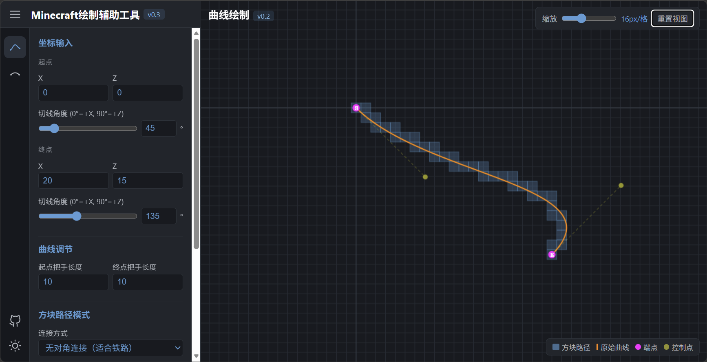

# Minecraft 绘制辅助工具

一个无需安装依赖的纯前端工具，用于将贝塞尔曲线、圆弧或完整圆离散为 Minecraft 水平面上的方块路径，适合辅助建造铁路、道路、墙壁和圆形结构。



## 使用方式

- **在线使用**：[Minecraft 绘制辅助工具](https://enchantedmurphy.github.io/MinecraftCurveDrawingAssistant/)
- **本地使用**：下载项目后直接用浏览器打开 `index.html`

所有计算均在浏览器本地完成。

## 界面与通用操作

左侧图标栏用于切换绘制功能，目前包括：

- **曲线绘制**（v0.2）
- **弧形绘制**（v0.1）

每个功能均包含参数面板、方块路径模式、生成按钮和坐标输出。右侧画布提供实时几何预览，并支持：

- 鼠标或单指拖拽平移
- 鼠标滚轮、缩放滑块或双指手势缩放
- 重置视图
- 深色/浅色主题切换
- 收起左侧参数面板

本工具只处理 Minecraft 水平面坐标，使用 `X Z` 表示位置，不包含 Y 轴。

## 曲线绘制

曲线绘制使用三次贝塞尔曲线。输入起点和终点的坐标、切线角度以及两端把手长度，即可确定曲线形状。

| 参数 | 说明 |
| --- | --- |
| 起点/终点 X、Z | 曲线两端的世界坐标 |
| 起点/终点切线角度 | `0° = +X`，`90° = +Z`；滑块与数值框双向联动 |
| 起点/终点把手长度 | 控制贝塞尔控制点到对应端点的距离 |

画布标记：

- 橙色线：原始贝塞尔曲线
- 紫色 `S` / `E`：起点和终点
- 黄色点及虚线：控制点和控制把手
- 蓝色方块：生成后的方块路径

## 弧形绘制

弧形绘制提供四种定义方式。

### 1. 圆心、半径、起止角度

输入圆心坐标、半径、起始角度、结束角度和绘制方向。

角度约定为：

- `0° = +X`
- `90° = +Z`

起始角度和结束角度均可通过滑块或数值框调整。

### 2. 起点、终点、半径

输入起点、终点和半径，并选择：

- 顺时针或逆时针
- 大圆弧或小圆弧

当同一组端点和半径对应多个可能圆弧时，方向与大/小圆弧选项共同确定唯一结果。半径不能小于起终点弦长的一半。

### 3. 起点、终点、弧上中间点

输入起点、终点和圆弧必须经过的第三个点。该点不要求是弧长中点，但三个点不能共线。

画布会使用蓝色 `M` 标记输入的弧上中间点。

### 4. 起点、切线角度、半径、方向、圆心角

输入起点、该点的切线角度、半径、顺/逆时针方向和圆心角。切线角度与圆心角均使用滑块和数值框联动调整。

画布会在起点处显示一条蓝色虚线，表示输入的切线方向。

### 绘制完整的圆

勾选“绘制完整的圆”后，当前方法将生成完整圆。结束角度、大/小圆弧或圆心角等用于控制弧长的选项会自动禁用。

弧形画布还会显示：

- 橙色线：原始圆弧或圆
- 紫色 `S` / `E`：弧形起点和终点
- 黄色点：圆心
- 蓝色方块：生成后的方块路径

输入不满足几何条件时，参数面板会显示对应的错误提示。

## 方块路径模式

曲线和弧形均支持两种连接方式：

- **无对角连接（4 邻接）**：相邻方块只允许沿 X 或 Z 方向移动，适合铁路等不能直接斜向连接的结构
- **有对角连接（8 邻接）**：允许斜向相邻，通常使用更少的方块，适合墙壁等结构

弧形的 4 邻接路径会依据候选方块到理论圆周的误差拆分斜步，以保持圆形路径关于圆心的上下、左右对称性。

## 坐标输出

点击“生成方块路径”后，方块坐标会按路径顺序输出，每行格式为：

```text
X Z
```

输出框下方会显示方块总数，可直接复制结果用于建造或进一步处理。

## 算法概览

### 贝塞尔曲线

1. 根据端点、切线角度和把手长度构造四个控制点。
2. 对三次贝塞尔曲线进行密集采样。
3. 沿采样结果追踪距离目标点最近的 8 邻接方块。
4. 在 4 邻接模式下，将斜步拆分为正交步。

### 圆弧

1. 根据所选定义方式求解圆心、半径、起始角和扫过角度。
2. 对理论圆弧进行密集采样并生成 8 邻接路径。
3. 在 4 邻接模式下，对每个斜步比较两个正交候选方块的圆周误差，选择更贴近理论圆周的方块。

## 项目文件

```text
.
├─ index.html      # 完整应用
├─ README.md       # 项目说明
└─ figs/
   ├─ logo.svg
   └─ demo_v0.3.png
```
